<div align="center">

# 🎓 Class Management System
### *Making classroom chaos manageable, one student at a time*


*Inspired by real classroom challenges — made to help teachers and students thrive.*

[🚀 Quick Start](#-quick-start) • [🖼️ A quick tour](#-a-quick-tour) • [🧭 How it flows](#-how-it-flows) • [🧪 Try the Demo](#-try-the-demo) • [🧰 Tech](#-tech-behind-the-scenes) • [📝 Notes](#-notes-and-tips) • [🐛 Troubleshooting](#-troubleshooting) • [👤 Creator](#-built-by-abhinav-kumar)

</div>


## 🖼️ A quick tour

### Welcome
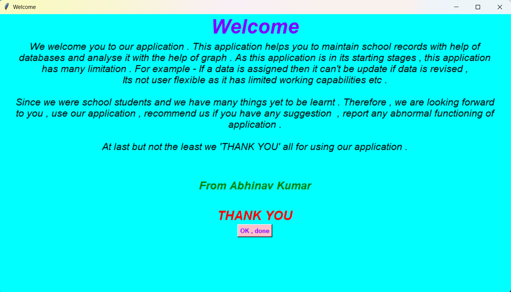
A warm welcome from the creator
### Main Window

The hub of the app with a clean, guided flow:
- **Add students**: Names, roll numbers, and more — validated and neatly stored.
- **Track attendance**: Enter absent roll numbers; everyone else is marked present automatically.
### Marks Entry Window
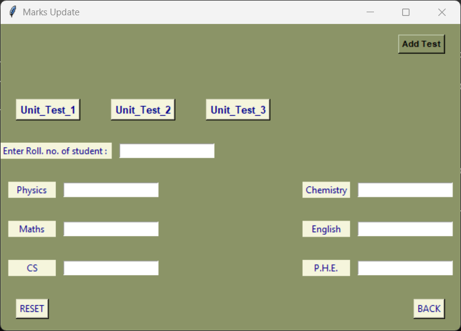
- **Enter marks fast**: A user friendly interface for entering the marks with auto-percentage calculation and overflow marks detection.
### Test Window
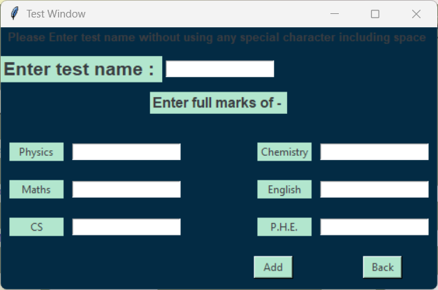
- **Create tests**: Unit_Test_1, Unit_Test_2, Unit_Test_3… choose subjects’ max marks once and reuse.
### Display
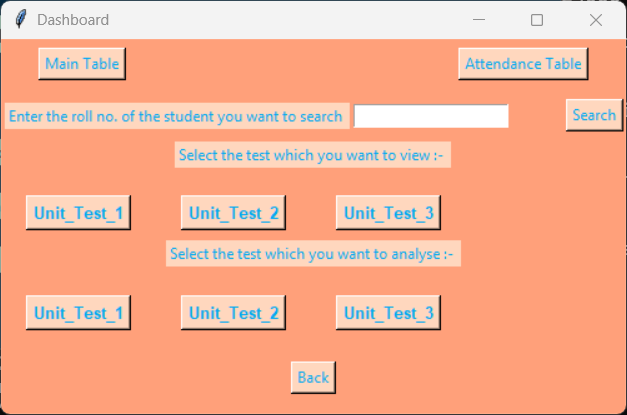
<br>Your viewing hub for everything you’ve entered — friendly, fast, and insightful:
- **See insights**: Averages, toppers, pass counts, and who’s above average.
- **Export easily**: CSV for tables, text reports for individual students.
- **Visualize performance**: Clear charts for subjects and tests.

## 🧭 How it flows
A quick guide to the typical flow:
- **Add Students**: `Input centre` → Enter details → `Enter data`
- **Attendance**: Type absent roll numbers (comma-separated) → pick date → `Enter attendance`
- **Tests & Marks**: `Marks Entry` → `Add Test` (name + max marks) → select test → fill marks → `ENTER`
- **View & Export**: `Data Viewing` → choose a table or analysis → `Export` to CSV/text

## Secret Hero
Behind the scenes, the database quietly keeps everything safe and organized.

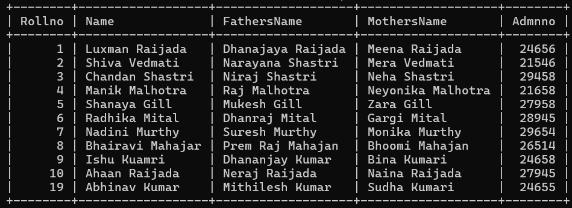
The main table stores each student’s core details.

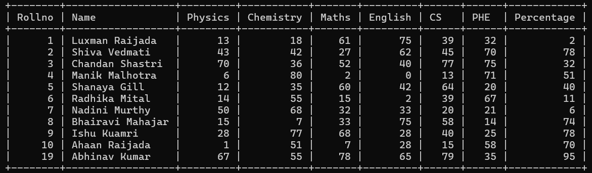
Example marks table for a specific test.

## Output Samples
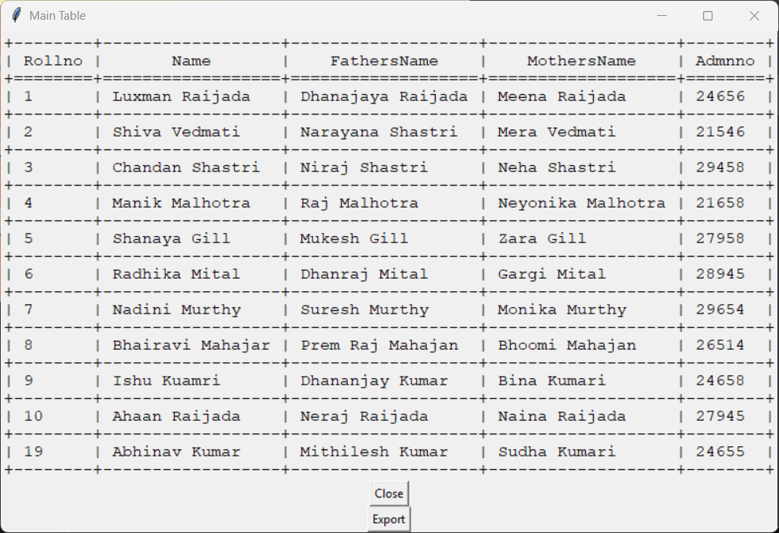
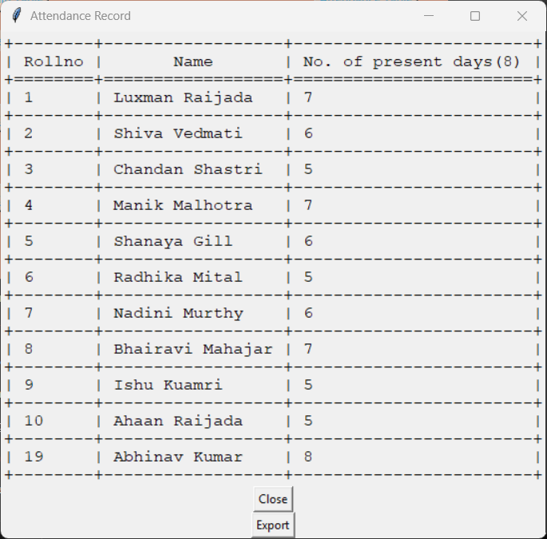
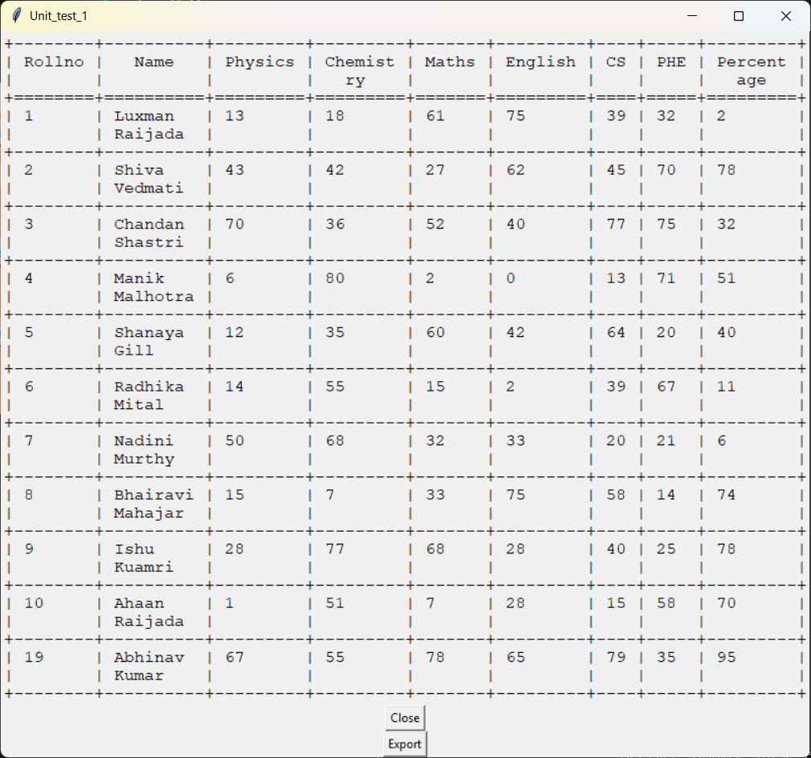
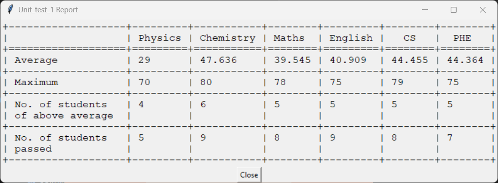
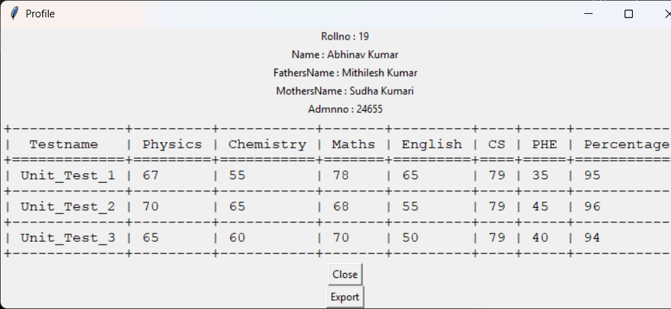
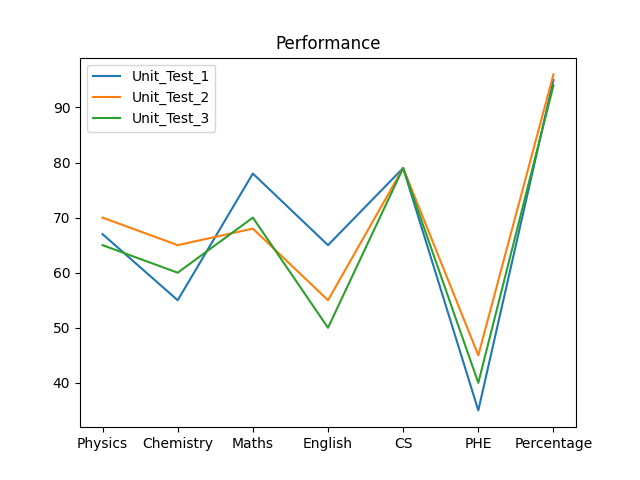

For more sample screenshots, explore the `Images/` folder in this project.

## ⚙️ What you need
- Python 3.x (tested on recent versions)
- MySQL Server
- Python packages listed in `requirements.txt`

Install packages:
```bash
pip install -r requirements.txt
```

## 🚀 Quick Start

**Ready to dive in? Here's the 2-minute setup:**

### Step 1: Get the Code
```bash
git clone <your-repo-url>
cd For_gift
```

### Step 2: Install Dependencies
```bash
pip install -r requirements.txt
```

### Step 3: Database Setup
Create `Access.txt` in the project root:
```
host=localhost,user=your_username,password=your_password,database=school_records
```

### Step 4: Launch! 🎉
```bash
python main.py
```

**That's it!** The app will create everything else automatically.

## 🧪 Try the Demo!

Want to see it in action without entering your own data?

```bash
python SQLentry.py
```

This fills your database with sample students, attendance, and test data. Perfect for exploring all features!

You’re in! Start by adding a few students, then try recording attendance and creating your first test.


## 🧰 Tech behind the scenes
<div align="center">

| Component | Technology | Why We Chose It |
|-----------|------------|-----------------|
| **Frontend** | Tkinter | Simple, reliable, comes with Python |
| **Backend** | Python 3.x | My favorite snake language 🐍 |
| **Database** | MySQL | Rock-solid data storage |
| **Visualization** | Matplotlib | Makes numbers beautiful |
| **Export** | CSV + Text | Universal compatibility |

</div>

See exact versions in `requirements.txt`.

## 📝 Notes and tips
- Names: alphabetic only. Numbers: numeric only. Marks: can’t exceed the max.
- Test names: no spaces or special characters.
- There’s a hidden button (bottom-right of main window) that drops the database. Powerful—use with extreme caution.
- Paths can be case-sensitive on Linux/macOS. Use exact casing like `Images/main_window.png`.

## ⚠️ Limitations
- Data entered via the UI cannot be edited or updated later.
- Fixed subject structure (6 subjects) for unit tests.
- No user authentication; intended for single-user local use.
- No automatic backups; export data manually for backups.
- Attendance input marks listed roll numbers as absent; others are marked present.

## 🐛 Troubleshooting
- Can’t connect to database? Ensure MySQL is running and `Access.txt` credentials are correct.
- Import errors? Run `pip install -r requirements.txt`.
- UI looks off? App is designed for ≥ 1000×600 resolution.

## 🙌 Built by **Abhinav Kumar**

This project was created to learn databases and GUI development. Your feedback makes it better—thank you for trying it! 🌟

## 📜 License & Usage

**This is my gift to the education community!** 🎁

Feel free to:
- ✅ Use it in your school
- ✅ Modify it for your needs  
- ✅ Learn from our code
- ✅ Share it with others
- ✅ Make it even better!

Just remember me when you do something awesome with it! 😊