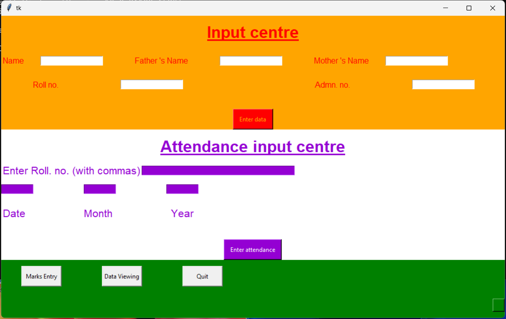
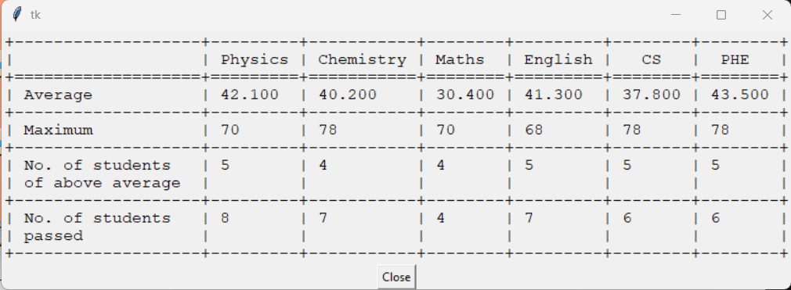

# 📚 Class Management System

A comprehensive desktop application for managing student records, attendance, and test scores with data visualization capabilities. Built with Python, Tkinter, and MySQL.

## 🌟 Features

### 1. **Student Information Management**
- Add and store student details (Name, Father's Name, Mother's Name, Roll Number, Admission Number)
- Automatic database initialization on first run
- Data validation to ensure accuracy
- View complete student records in organized tables



### 2. **Attendance Tracking**
- Record daily attendance by entering roll numbers of absent students
- Date-wise attendance management (Day, Month, Year)
- Automatic calculation of present days
- Export attendance data to CSV format
- Visual attendance summary for each student

### 3. **Test Management System**
- Create multiple tests dynamically (UT1, UT2, UT3, etc.)
- Define custom maximum marks for each subject
- Subjects supported:
  - Physics
  - Chemistry
  - Mathematics
  - English
  - Computer Science (CS)
  - Physical & Health Education (P.H.E.)


### 4. **Marks Entry**
- Easy-to-use interface for entering student marks
- Automatic percentage calculation
- Validation to prevent marks exceeding maximum limits
- Roll number-based student identification
- Reset functionality for quick corrections


### 5. **Data Viewing & Analysis**
- **Main Table View**: Complete student information
- **Attendance Summary**: Present days count for each student
- **Test Results**: View marks for any test
- **Student Search**: Search individual student records with complete academic history
- **Test Analysis**: Statistical analysis including:
  - Average marks per subject
  - Maximum marks achieved
  - Number of students above average
  - Number of students passed (33% criteria)




### 6. **Data Export**
- Export tables to CSV format
- Export individual student reports to text files
- Easy data sharing and backup

### 7. **Performance Visualization**
- Graphical representation of student performance across tests
- Subject-wise comparison using matplotlib
- Visual trend analysis for individual students

## 🛠️ Technology Stack

- **Frontend**: Tkinter (Python GUI framework)
- **Backend**: Python 3.x
- **Database**: MySQL
- **Data Visualization**: Matplotlib
- **Data Processing**: 
  - texttable (for formatted table display)
  - csv (for data export)

## 📋 Prerequisites

- Python 3.x
- MySQL Server
- Required Python packages (see `requirements.txt`)

## 🚀 Installation

1. **Clone or download the repository**

2. **Install required packages**:
   ```bash
   pip install -r requirements.txt
   ```

3. **Configure database access**:
   
   Create an `Access.txt` file in the project root with the following format:
   ```
   host=localhost,user=your_username,password=your_password,database=school_records
   ```

4. **Run the application**:
   ```bash
   python main.py
   ```

## 📦 Dependencies

```
matplotlib==3.10.7
mysql_connector_repackaged==0.3.1
texttable==1.7.0
```

## 🗂️ Project Structure

```
For_gift/
│
├── main.py                    # Application entry point
├── main_window.py             # Main interface with student & attendance input
├── test_window.py             # Test marks entry interface
├── new_test_window.py         # Add new test interface
├── output_window.py           # Data viewing and analysis interface
├── First_interface.py         # Welcome screen
├── SQLentry.py                # SQL utility functions for creating sample database
├── Access.txt                 # Database credentials 
├── SQL.txt                    # Sample SQL commands for sample database
├── requirements.txt           # Python dependencies
├── README.md                  # This file
└──  Images/                   # Sample images for reference
```

## 💡 Usage Guide

### First Time Setup

1. Check that MySQL server is running and accessible
2. Ensure `Access.txt` contains correct database credentials
3. Run `main.py` to initialize the database and tables
4. The application will automatically create the database and required tables
5. A welcome screen will appear with project information
6. Click "OK, done" to proceed to the main window

### Adding Students

1. In the **Input centre** section (orange background):
   - Enter student name, father's name, and mother's name
   - Enter roll number and admission number
   - Click "Enter data" button
2. Student data is automatically added to both main table and attendance table

### Recording Attendance

1. In the **Attendance input centre** section (white background):
   - Enter roll numbers of **absent** students (comma-separated)
   - Enter the date (Day, Month, Year)
   - Click "Enter attendance" button
2. System marks entered students as absent, others as present

### Managing Tests

1. Click "Marks Entry" button from main window
2. Click "Add Test" to create a new test:
   - Enter test name (no spaces or special characters)
   - Enter maximum marks for each subject
   - Click "Add" button
3. Select a test from the available buttons
4. Enter roll number and marks for each subject
5. Click "ENTER" to save marks

### Viewing Data

1. Click "Data Viewing" button from main window
2. Options available:
   - **Main Table**: View all student information
   - **Attendance Table**: View attendance summary
   - **Test Results**: Select and view any test results
   - **Student Search**: Enter roll number to view complete student profile
   - **Test Analysis**: Select test for statistical analysis

### Exporting Data

- When viewing any table, click the "Export" button
- Data will be saved as CSV file in the project directory
- For student search results, data is exported as text file

## 🎨 Color Scheme

- **Input Centre**: Orange (#FFA500) - Student information entry
- **Attendance Centre**: White with Purple (#9400d3) accents
- **Navigation**: Green background
- **Marks Entry**: Olive green (#8B9467) with beige (#F5F5DC) elements
- **Add Test**: Dark blue (#032B44) with mint (#B2E6CE) accents
- **Output Window**: Light salmon (#FFA07A) with peach (#FFD7BE) elements

## ⚠️ Important Notes

### Limitations

1. **No Data Update**: Once data is entered, it cannot be modified through the UI
2. **Limited Flexibility**: Fixed subject structure (6 subjects)
3. **No User Authentication**: Single-user application
4. **No Data Backup**: Manual backup required
5. **Attendance Logic**: System records absent students; all others marked present

### Data Validation

- Names must contain only alphabetic characters
- Roll numbers and admission numbers must be numeric
- Marks cannot exceed the maximum marks defined for the test
- Test names should not contain spaces or special characters

### Database Management

- Hidden button in bottom-right corner of main window can drop the database (use with caution)
- Database is automatically created if it doesn't exist
- All tables are created with proper relationships

## 🐛 Troubleshooting

### Database Connection Error
- Verify MySQL server is running
- Check `Access.txt` credentials are correct
- Ensure database user has proper privileges

### Module Import Error
- Install all dependencies: `pip install -r requirements.txt`
- Ensure Python version is 3.x

### GUI Display Issues
- Check screen resolution (designed for 1000x600 minimum)
- Ensure Tkinter is properly installed with Python

## 👥 Authors

This application was developed by school students as a learning project:

- **Abhinav Kumar**
- **Utkarsh Nag**
- **Tanisq Choudhary**
- **Dhruv Kumar**

## 🙏 Acknowledgments

This is a student project created to learn database management and GUI development. The developers welcome feedback, suggestions, and bug reports to improve the application.

## 📝 License

This is an educational project. Feel free to use and modify for learning purposes.

## Sample

Run SQLentry.py after first time setup to create the sample tables. The script will enter the sample data automatically on run.
See, pictures in Images for reference.

- Main_Table.png
- Attendance_Table.png
- Search_Result1.png
- Search_Result2.png
- UT1_Table.png
- UT1_Analysis.png

Reference pictures of database tables.

- maintable.png
- attendance.png
- test.png
- ut1.png

## 📞 Support

For suggestions, bug reports, or feedback, please contact the development team.

---

**Thank you for using our Class Management System!** 🎓
